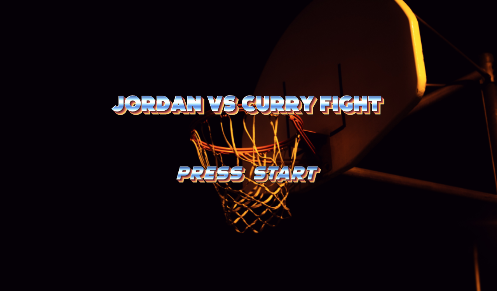
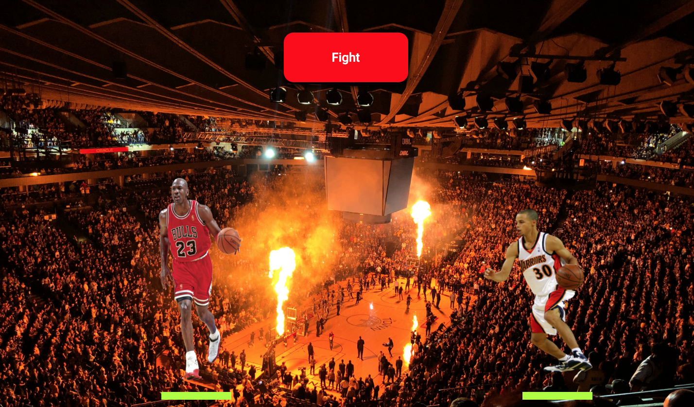
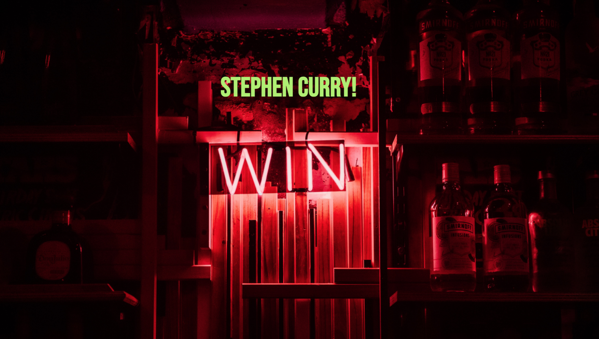

# Jordan Vs Curry  🚀
_Este proyecto es un mini juego realizado con el metodo SPA (Single Page Aplication)._

***

### Pre-requisitos 📋
_Se puede ver en cualquier navegador web._
***
### Instalación 🔧

_Solo tienes que hacer click en el siguiente link....._

https://ibralzuru.github.io/ProyectoJuegoPeleas/

***
### Pruebas ⚙️

_He dividido el juego en 3 pantallas:_

_En esta pantalla se ven las letras del juego y también se accede a la cruenta batalla._

_Aquí se realiza el enfrentamiento.
Solo tiene que quemar el botón Fight y esperar el resultado._

_En esta última pantalla se termina el juego y ves el nombre del ganador!._

***

### Para esta web utilice los siguientes lenguajes:🛠️

* Html5
* Css
* JavaScript

***

### Autor ✒️

Ibralzuru

## Mención Especial para: 🎁

* La Clase Geeks Barcelona 🍺 
* Los profesores 📢
* etc..... 🤓

## Con ❤️ Ibra Alzuru C.
